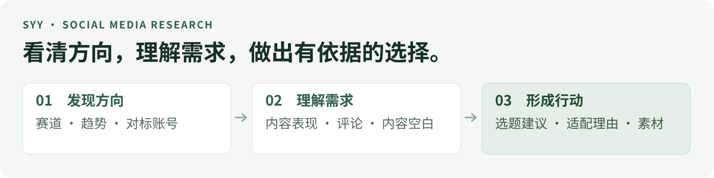

# Syy-zimeiti-skills

**帮你研究社交平台上的内容、账号和用户需求，找到有依据、适合自己的创作方向。**

想做一个赛道，却不知道从哪里入手？想找对标，却只看到粉丝数？选题写了一堆，却说不清观众为什么需要？这个 Skill 把这些问题拆成具体的研究任务，再把公开数据整理成你能据此行动的结论。



中文研究交付 · 11 种研究模式 · 按需组合 · 保留原始证据

**适用平台：Codex · WorkBuddy · 豆包工作。** 本 Skill 采用 `SKILL.md` 结构，可在支持导入自定义 Skill 的版本中使用。各平台的导入入口、脚本运行和数据读取权限可能不同；目前已验证 Codex 的离线流程，WorkBuddy 和豆包工作尚待实机验证。

### 从找爆款，到写出自己的视频初稿

围绕一条视频，可以按下面五步推进：

| 你想做什么 | 它可以怎样帮你 |
|---|---|
| **① 找爆款** | 从指定平台的样本中筛选表现突出的内容，整理值得进一步分析的视频 |
| **② 查对标** | 找与你的赛道和定位相关的账号，比较内容方向、近期表现和观众反馈 |
| **③ 整理视频数据** | 汇总视频链接、标题、发布时间及已有的播放、互动等数据，便于筛选和对比 |
| **④ 拆解爆款结构** | 结合原始文案或可核实的字幕，分析开头、内容展开、信息交付与结尾的组织方式 |
| **⑤ 生成可修改的视频初稿** | 在研究结果基础上，继续向 AI 提供你的人设、经历和素材，生成带有自己表达的视频初稿 |

**快速导航：** [能帮你什么](#help) · [功能总览](#features) · [使用流程](#workflow) · [小白使用引导](#beginner) · [交付结果](#outputs) · [复制示例](#examples) · [安装与准备](#start) · [文档入口](#docs)

<a id="help"></a>

## 它能帮你什么

适合做内容的个人创作者、自媒体运营，以及需要了解公开用户反馈的品牌或产品团队。研究主题由你指定，可以是 AI 教程、家居、咖啡、摄影、运动，也可以是某个产品、品牌或具体账号。

| 你现在遇到的问题 | 它会帮你做什么 |
|---|---|
| 想进入一个赛道，但方向太宽 | 拆出子赛道、常见问题与代表内容，帮你缩小研究范围 |
| 想找对标，却不知道谁值得参考 | 比较账号主题、近期表现和受众反馈，整理对标名单与理由 |
| 想知道某条内容为什么表现突出 | 和该账号近期样本比较，再分析话题、开头、形式与评论 |
| 不知道观众真正需要什么 | 从评论中整理反复出现的问题、顾虑、比较需求和教程需求 |
| 有很多想法，却难以选出下一条 | 结合样本证据、账号定位和可用素材，给出选题与下一步建议 |

**你只需要说明研究目标。** Skill 会据此选择研究模式；可以只查一个问题，也可以把多项功能串成一次完整研究。

<a id="features"></a>

## 功能总览

下面是全部 11 项功能，按你做决策时的顺序分成四组。每项都写明了要回答的问题和对应产出，方便直接选用。

### 01 · 找方向：先看清你想做的领域

| 功能 | 回答什么问题 | 你会得到什么 |
|---|---|---|
| **赛道与子赛道发现** | 一个大方向里，还能细分出哪些值得研究的方向？ | 子赛道清单、常见问题与后续搜索方向 |
| **趋势扫描** | 指定时间内，样本中反复出现哪些话题？ | 近期主题、热词与趋势线索；有可比时段时再分析变化 |
| **市场地图** | 这个领域有哪些参与者、内容形式和需求？ | 账号、品牌、主题与需求之间的结构梳理 |

### 02 · 看对标：理解账号与内容的表现

| 功能 | 回答什么问题 | 你会得到什么 |
|---|---|---|
| **对标账号发现** | 哪些账号与我的方向相关，值得进一步观察？ | 代表账号名单、内容定位与入选理由 |
| **账号审计** | 一个账号最近在做什么，平常表现怎样？ | 内容结构、发布节奏和近期样本表现基线 |
| **高表现内容拆解** | 哪些内容明显高于这个账号的近期水平，可能因为什么？ | 异常样本、话题与形式对比，以及可复用因素和偶然因素的判断 |

### 03 · 读需求：找出观众仍然关心的问题

| 功能 | 回答什么问题 | 你会得到什么 |
|---|---|---|
| **评论需求挖掘** | 观众反复在问什么、担心什么、想比较什么？ | 问题分组、样本中的出现情况与代表评论 |
| **内容空白分析** | 采集到的样本中，哪些需求还没有被充分回答？ | 未满足问题、现有内容覆盖情况与待验证机会 |
| **品牌与产品研究** | 大家如何评价一个品牌或产品，有哪些购买顾虑？ | 公开反馈、比较维度、常见疑问与内容机会 |

### 04 · 定行动：决定做什么、放在哪里

| 功能 | 回答什么问题 | 你会得到什么 |
|---|---|---|
| **跨平台比较** | 同一主题在我指定的平台上，有什么差异？ | 主题、需求和内容形式的比较；标明不能直接比较的指标 |
| **选题生成** | 结合这些证据，我的账号接下来适合做什么？ | 具体选题、研究依据、账号适配理由和素材需求 |

**怎么选：** 只想找对标，就用“对标账号发现”；已经有账号，就从“账号审计”开始；不知道下一条做什么，可以组合“评论需求挖掘 → 内容空白分析 → 选题生成”。

<details>
<summary>查看 11 项功能对应的研究模式名称</summary>

| 功能 | 模式名称 |
|---|---|
| 赛道与子赛道发现 | `niche-discovery` |
| 趋势扫描 | `trend-scan` |
| 市场地图 | `market-map` |
| 对标账号发现 | `competitor-discovery` |
| 账号审计 | `account-audit` |
| 高表现内容拆解 | `viral-breakdown` |
| 评论需求挖掘 | `comment-mining` |
| 内容空白分析 | `content-gap` |
| 品牌与产品研究 | `brand-product` |
| 跨平台比较 | `cross-platform` |
| 选题生成 | `idea-generation` |

完整执行说明见 [SKILL.md](skills/syy-zimeiti-skills/SKILL.md)，方法细节见 [研究方法](skills/syy-zimeiti-skills/references/research-playbooks.md)。

</details>

<a id="workflow"></a>

## 这些功能怎么串起来

没有配置 TikHub Key 时，Syy 可以先检查本地连接状态。如果你给出抖音公开主页或视频链接，且当前工具能够读取页面，仍可围绕**这些指定链接**整理作品和可见数据；有多个同账号作品且能读到点赞数时，可比较相对点赞表现。它不代表全站搜索，也不能推出缺失的播放量或评论。没有可用工具时，会说明可用资料和下一步采样方案。

一次研究的基本顺序是：**说清目标 → 验证小样本 → 按需分析 → 给出结论和建议。**

| 步骤 | 你提供什么 / Skill 做什么 |
|---|---|
| **1. 确定范围** | 你说明主题、平台、时间窗和想解决的问题；涉及选题时补充账号定位与素材条件 |
| **2. 验证数据** | Skill 使用可用的数据工具或你提供的资料，先检查 1–3 个样本，确认字段、时间和内容是否合适 |
| **3. 选择分析路径** | 按目标组合研究模式，整理账号、内容、评论和需求；扩大采样时按已有授权与预算执行 |
| **4. 交付研究结果** | 先给主要发现和建议，再附原始来源、采样范围、判断依据与局限 |

例如，研究“抖音上的 AI 办公教程”，可以这样走：

> 扫描近期主题 → 找代表账号 → 比较高表现内容 → 整理评论中的问题 → 给出适合你账号的选题。

每一步的结果都会成为下一步的依据。任务只涉及其中一项时，就执行相关部分。

<a id="beginner"></a>

## 第一次使用：跟着这 5 步做

以下从 **Skill 已导入你正在使用的平台** 开始。Codex 可输入 `$syy-zimeiti-skills` 调用；在 WorkBuddy 或豆包工作中，先选中或指定已导入的同名 Skill。下面以“抖音 AI 工具分享”为例，换成你的平台和内容方向即可。

1. **说目标。** 新开对话，告诉它你要研究什么，并请它一次引导一步：
   > 我在抖音做 AI 工具分享，想找到下一条视频的选题。请一步一步带我做，每次只告诉我下一步需要什么。先不要使用付费数据接口。
2. **发资料。** 按提示发 1 个想研究的账号链接，或 2～3 条关注的视频链接；有评论截图也可以发。手头没有链接，就说：“我没有链接，请告诉我先去哪里找、找到后发给你什么。”
3. **看分析。** 发完资料后继续说：
   > 请分析我发的内容：视频在讲什么、哪些内容比较受关注、评论里的人在问什么？请用简单的话说明依据；看不到的数据就说不知道。
4. **选题。** 告诉它你的观众和真实经历，再继续说：
   > 结合刚才的分析和我的实际经历，给我 3 个适合自己拍的选题。每个说清观众的问题、我能展示什么，以及为什么推荐。
5. **写初稿。** 选中一个选题，在同一对话里继续说：
   > 我选第 1 个。请结合我的真实经历写一份可修改的口播初稿，不照搬别人的话，也不编造我的经历和效果。

不满意就指出要改的地方，例如“开头太长，缩短一点，其他不动”。**记住：说目标 → 发资料 → 看分析 → 选题 → 改初稿。** 如果平台内容读不到，就提供你能看到的链接、截图或评论，让它先分析这些材料。

<a id="outputs"></a>

## 最后能拿到什么

交付内容随任务调整。完整研究可以包含以下五类结果，小任务保留与你的问题相关的部分。

| 交付内容 | 里面有什么 | 你可以用来做什么 |
|---|---|---|
| **研究结论** | 主要发现、判断依据、建议与不确定之处 | 快速了解这次研究发现了什么 |
| **账号与内容清单** | 代表账号、异常样本、原始链接与入选理由 | 继续观察对标和核对具体案例 |
| **评论需求整理** | 问题类别、采样覆盖与代表评论 | 确定哪些问题值得回答 |
| **选题建议** | 具体问题、样本依据、适配理由、素材需求与置信度 | 安排下一条内容的准备工作 |
| **证据与覆盖说明** | 采集时间、搜索范围、样本规模、缺失字段与数据来源 | 判断结论适用范围并复查来源 |

一条选题建议会尽量交代清楚：

> **做什么 → 观众为什么需要 → 证据在哪里 → 为什么适合你 → 需要准备什么。**

实际报告结构见 [报告模板](skills/syy-zimeiti-skills/templates/report.md)。选题机会分数用于安排研究优先级，不预测播放量或收益。

### 继续创作：结合你的人设和经历，生成视频初稿

研究完成后，可以在同一 AI 对话中继续创作：提供**你的人设定位、真实经历、表达习惯和可用素材**，让 AI 根据研究发现，整理出一份可以继续修改的口播视频初稿。

初稿可以包含**开头、内容展开、自己的经历或案例、结尾**，方便你接着调整措辞、补充细节和准备拍摄。

```text
基于上面的研究结果，继续帮我写一份可以修改的口播视频初稿。
我的人设和观众是：[填写你的定位与受众]。
我的真实经历和可用素材是：[填写你自己的经历、案例和素材]。
我的表达习惯是：[填写语气、口头习惯与希望的视频时长]。
请用我的经历和表达组织内容，给出开头、内容展开和结尾。
资料不足的地方标注待补充，不虚构我的经历。
```

<a id="examples"></a>

## 复制示例，开始使用

安装后，Codex 可输入 `$syy-zimeiti-skills`；WorkBuddy 和豆包工作请在各自界面指定已导入的同名 Skill。下面示例采用 Codex 的调用写法，主题、时间和账号条件都可以替换成自己的。

### 我还没方向，想做一次完整研究

```text
$syy-zimeiti-skills
研究最近 30 天抖音上的 AI 办公教程，只研究抖音。
我的观众是刚开始用 AI 的上班族，能拍口播和电脑录屏。
先用小样本找近期主题、对标账号和评论需求，
再推荐 5 个适合我的选题，说明证据、适配理由和所需素材。
给出原始链接、采集时间、样本规模与局限；先说明采样计划。
```

### 我已经有方向，想找对标

```text
$syy-zimeiti-skills
帮我找小红书上的家用咖啡对标账号，观察最近 30 天。
比较内容主题、近期表现和评论问题，说明哪些值得参考、为什么。
先验证小样本，给出原始链接和实际覆盖范围。
```

### 我想从评论里找下一条选题

```text
$syy-zimeiti-skills
分析我提供的抖音帖子和评论资料。
整理反复出现的问题、顾虑和教程需求，保留代表评论与样本量。
我的账号面向摄影新手；据此推荐 5 个能用手机实拍讲清楚的选题。
```

<details>
<summary>更多用法：账号诊断、跨平台比较、品牌与产品反馈</summary>

**诊断一个账号**

```text
$syy-zimeiti-skills
分析这个公开账号：[填写账号链接]。
在最近 30 天的样本中建立表现基线，找出明显高于基线的内容。
比较它们的话题、开头、形式和评论，区分可复用因素与偶然因素。
缺失指标请保留缺失，不用点赞推算播放量。
```

**比较两个平台**

```text
$syy-zimeiti-skills
比较最近 30 天抖音与小红书的“新手跑步”内容。
分别整理热门主题、观众问题和内容形式，再分析各自的选题机会。
各平台内分别判断表现，并注明不能直接比较的指标和数据缺口。
```

**研究一个产品**

```text
$syy-zimeiti-skills
研究小红书上关于 [产品名称] 最近 30 天的公开讨论。
整理购买顾虑、竞品比较和用户想了解但还没被讲清楚的问题。
区分可核实事实、用户评价和分析推断，附来源与覆盖说明。
```

原有英文示例见 [examples/prompts.md](skills/syy-zimeiti-skills/examples/prompts.md)。

</details>

<a id="start"></a>

## 安装与准备

### 1. 把 Skill 放进 Codex（其他平台按各自的导入流程操作）

下载本仓库，将 **`skills/syy-zimeiti-skills` 整个文件夹**复制到个人 Codex 的 `skills` 目录，保留其中的脚本、参考资料、模板和许可文件。

默认目录为 `~/.codex/skills/`；Windows 通常是 `C:\Users\你的用户名\.codex\skills\`。自定义过 `CODEX_HOME` 时，使用该目录下的 `skills` 文件夹。安装后从下一轮对话开始使用。

WorkBuddy 和豆包工作的自定义 Skill 导入入口、文件格式要求与权限随版本而异；本仓库尚未对这两端进行实机安装验证，请按客户端当前提示导入整个 Skill 文件夹并核对能否调用。

最终结构应是：

```text
个人 Codex skills 目录/
└── syy-zimeiti-skills/
    ├── SKILL.md
    ├── agents/
    ├── references/
    ├── templates/
    ├── examples/
    ├── scripts/
    └── LICENSE
```

### 2. 准备研究资料或数据连接

| 你有什么 | 怎么开始 |
|---|---|
| **当前已连接的公开数据工具** | 说明研究主题与平台，使用可用工具进行采样 |
| **自己收集的帖子、评论、截图或数据文件** | 提供资料，分析其中可核实的内容；截图只支持画面可见的信息 |
| **希望使用 TikHub 连接** | 准备自己的账户、网络与 `TIKHUB_API_KEY`，确认平台覆盖和费用后调用 |
| **暂时没有平台数据** | 先整理研究简报、采样计划或分析已有资料，明确哪些判断仍需验证 |

平台可以指定抖音、小红书、B 站、YouTube、TikTok、Reddit 等；**实际能采集哪些平台、哪些字段，以你使用的数据工具、权限与当前服务为准**。平台选择建议见 [平台指南](skills/syy-zimeiti-skills/references/platforms.md)。

### 3. 发出第一次研究请求

最少说清楚：**研究什么、在哪个平台、看哪个时间段、希望得到什么**。需要选题时，再补充你的受众、经验与可展示素材。可以直接复制上面的 [完整研究示例](#examples)。

<details>
<summary>技术说明：Python、TikHub 与四个辅助脚本</summary>

执行配套脚本需要 Python 3.9 或更高版本；脚本只使用 Python 标准库，无需第三方 Python 包。以下命令从仓库根目录进入 Skill 文件夹后执行；如果 `python` 不在 PATH，用已有 Python 可执行文件的完整路径替代。

```powershell
Set-Location .\skills\syy-zimeiti-skills
python scripts\estimate_cost.py --requests 20
python scripts\tikhub_mcp.py --help
python -m unittest discover -s tests -v
```

| 脚本 | 用途 |
|---|---|
| `tikhub_mcp.py` | 发现 TikHub 当前工具并调用可用接口 |
| `estimate_cost.py` | 规划请求量；提供单价假设时估算费用范围 |
| `normalize.py` | 按明确的字段映射整理原始数据 |
| `score_posts.py` | 计算有效互动指标与同平台账号样本内的相对表现 |

TikHub 连接需要在本地设置环境变量。示例中的 `YOUR_API_KEY` 是占位符，真实密钥请仅保存在本地。

```powershell
$env:TIKHUB_API_KEY = 'YOUR_API_KEY'
python scripts\tikhub_mcp.py discover --platform douyin --query 'search video keyword'
```

具体工具名与参数以当前返回的 schema 为准。Windows 下 JSON 参数可写入本地文件，再使用 `--args-file`。完整命令和执行顺序见 [SKILL.md](skills/syy-zimeiti-skills/SKILL.md)。

TikHub 是可选连接，可能收费。未提供单价时费用脚本只给出请求量和“价格未知”；显式输入单价后的金额仅为假设性估算。

</details>

## 使用时需要知道的边界

- **结论对应实际样本。** 近期话题线索、搜索结果和公开互动各有用途；增长、完播或转化判断需要相应数据支持。
- **缺失数据会明确保留。** 不用点赞推算播放，不从标题或封面还原原始口播稿。
- **选题会考虑你自己的条件。** 对标帮助理解问题与方法，创作采用自己的经验、素材和表达；没有账号信息时，适配判断会标为暂定。
- **效果与接入需分别验证。** 仓库有离线验证记录，真实平台采集和 TikHub 账户连接仍需实际验证；研究建议不承诺流量、涨粉或收益。

<a id="docs"></a>

## 文档入口

| 你想继续了解什么 | 从这里进入 |
|---|---|
| Skill 的完整执行逻辑 | [SKILL.md](skills/syy-zimeiti-skills/SKILL.md) |
| 研究如何采样、比较和分析 | [研究方法](skills/syy-zimeiti-skills/references/research-playbooks.md) · [创作者研究补充](skills/syy-zimeiti-skills/references/creator-research.md) |
| 表现指标与证据如何判断 | [评分方法](skills/syy-zimeiti-skills/references/scoring.md) · [证据规则](skills/syy-zimeiti-skills/references/evidence.md) |
| 研究前后的文档结构 | [研究简报模板](skills/syy-zimeiti-skills/templates/research_brief.md) · [报告模板](skills/syy-zimeiti-skills/templates/report.md) |
| 更多请求示例与接入说明 | [示例](skills/syy-zimeiti-skills/examples/prompts.md) · [Skill 使用说明](skills/syy-zimeiti-skills/README.md) |
| 当前已有的验证与适用范围 | [验证记录](VALIDATION.md) |
| 数据使用与第三方服务说明 | [数据使用边界](skills/syy-zimeiti-skills/references/safety.md) · [第三方说明](skills/syy-zimeiti-skills/THIRD_PARTY_NOTICES.md) |
